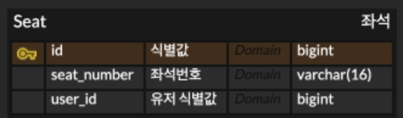

# Optimistic Lock

## Overview

최근까지 데이터베이스 락을 걸 때 비관적 락을 사용하고 낙관적 락은 사용할 경우가 없다고 생각했다. 
JPA에서 낙관적락은 `@Version` 을 사용하여 version 컬럼 또는 updateAt 컬럼을 활용한 방법으로 동시성을 처리한다.

하지만 낙관적락 개념은 데이터베이스에 있는 개념이며 version 을 사용하지 않고도 다른 컬럼을 이용하여 동시성 처리를 할 수 있다. 

그 동안 낙관적 락이 version 으로 동작하는 것은 알았지만 동작방식을 정확히 알지 못했던 것 같다.

## Situation

오버부킹이 불가능한 기차 예매 시스템을 설계한다. 
좌석을 모두 테이블에 넣어두고 예약 요청이 들어오면 Update 하는 형태로 한다. 
로그인, 기차, 시간 등은 고려하지 않고 좌석 예매에만 초점을 맞춘다.

## Stack

- Kotlin
- Spring boot 3.1
- Spring data JPA
- MySQL8
- Kotest

## ERD

## Conclusion

# optimistic-lock
